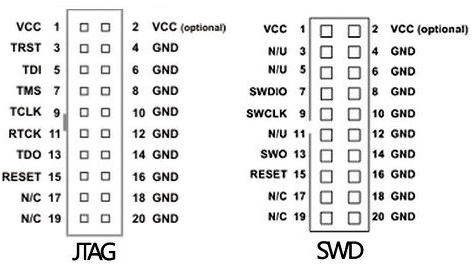

分析三个调试器在STM32F103CxT6上的io分布

<!-- more -->

# daplink jlink stlink diy硬件兼容性分析

| interface  | daplink        | stlink         | Blackmagic probe(bluepill firmware) | jlink ob(An old design)       |
| ---------- | -------------- | -------------- | ----------------------------------- | ----------------------------- |
| SWDIO/JTMS | PB14-100R-PB12 | PB14-100R-PB12 | PB14                                | PA7(PA4-R-PA7)                |
| SWCLK/JTCK | PB13-PA5       | PB13-PA5       | PA5                                 | PA5(PA3-R-PA5-PB13)           |
| JTDI       | NS             | PA7            | PA7                                 | PA2(PB0-R-PB14)               |
| JTDO/SWO   | NS             | PA6            | PA6                                 | PA10(V1.4:PA6)(PA6-PB15-PA10) |
| nRST       | PB0            | PB0            | PB0/PB6                             | PA1(PA2-R-PA1)                |
| UTX        | PA2            | PA2            | PA2                                 | NS                            |
| URX        | PA3            | PA3            | PA3                                 | NS                            |
| SWO        | PA10           | PA10           | PA10                                | PA10                          |
| USB D+     | NC             | PA15           | NC                                  | PA9                           |

附标准jtag接口定义

