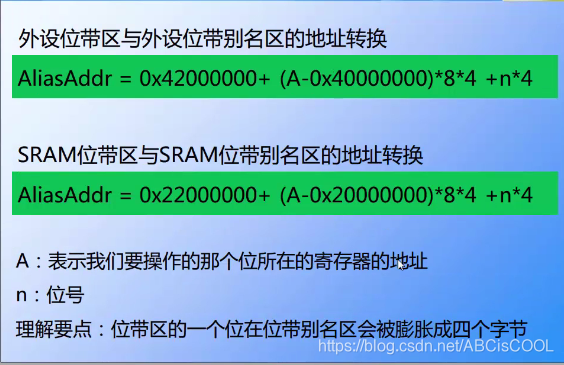

STM32支持一种特别的位操作方式

类似于51单片机的sbit

<!-- more -->

# STM32 bit-band(位带)操作

> sbit: 定义特殊功能寄存器的位变量。
>
> 典型应用：sbit P0_0=P0^0;//即定义P0_0为P0口的第1位，以便进行位操作。
>
> 用法：
>
> 在C语言里，如果直接写P1.0，C编译器并不能识别，而且P1.0也不是一个合法的C语言变量名，所以得给它另起一个名字，这里起的名为P1_0，可是P1_0是不是就是P1.0呢？你这么认为，C编译器可不这么认为，所以必须给它们建立联系，这里使用了Keil C的关键字sbit来定义，sbit的用法有三种：
>
> 第一种方法：sbit 位变量名=地址值
>
> 第二种方法：sbit 位变量名=SFR名称^变量位地址值
>
> 第三种方法：sbit 位变量名=SFR地址值^变量位地址值
>
> 如定义PSW中的OV可以用以下三种方法：
>
> sbit OV=0xd2 （1）说明：0xd2是OV的位地址值
>
> sbit OV=PSW^2 （2）说明：其中PSW必须先用sfr定义好
>
> sbit OV=0xD0^2 （3）说明：0xD0就是PSW的地址值
>
> 因此这里用sbit P1_0=P1^0;就是定义用符号P1_0来表示P1.0引脚，如果你愿意也可以起P10一类的名字，只要下面程序中也随之更改就行了。
>
> sbit与bit：
>
> sbit 要在最外面定义,就是说必须定义成外部变量.sbit定义的是SFR(特殊功能寄存器)的bit
>
> sbit更像是类型定义，不像是变量定义。
>
> sbit: 只是说明性说明
>
> bit 可以在外部或内部定义。
>
> 引用自http://news.eeworld.com.cn/mcu/2015/1010/article_22855.html

STM32中定义两个位带操作区,分别位于片上外设区和SRAM

> - 位带区：支持位带操作的地址区。
> - 位带别名区：对别名地址的访问最终作用到位带区的访问上。位带别名区对位带区的访问有个地址映射过程。
>   **目的**
>   对位带区的比特位进行独立的读写操作，即单独操作一个位 ，它是通过对位带别名区的操作来实现。
>   **具体过程**：
>   对位带别名区进行读写访问，位带别名区通过地址映射关系映射到相应的位带区，对位带区进行原始比特的读写操作。

通过对位带别名区进行操作,可以改变原寄存器中相应位的值而不用读取-计算-写入,将这个操作简化为了一个写入操作

## 二、计算公式

字节地址为A，比特位序号为n(0<=n<=7)
说明：“*4”表示一个字为4个字节，“*8”表示一个字节中有8个比特。



统一转换公式

```
((addr&0xF0000000)+0x02000000+((addr & 0x000FFFFF)<<5)+(bitnum<<2))
```

