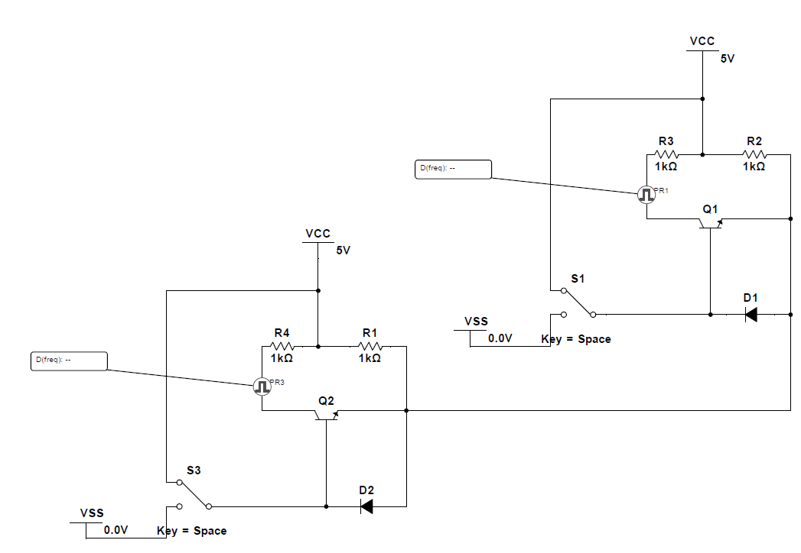

## 串口半双工自动切换电路

该电路可以用一根线半双工的传输uart信号 无需使用额外操作切换信号方向

灵感来自485电路中的自动信号方向切换

<!-- more -->

图中两个Key代表信号发送端 实际应用时去掉开关并将右侧连接MCU的TX

两个测试点PR代表接收端 直接将PR所在的线连接到MCU的RX

由于是半双工 不可以同时发送数据 会导致数据出错 推荐其中一个作为主机 采用应答式交换数据(类似于485总线)

测试

