---

title: 搭建神经网络本地训练环境

date: 2024-04-02 09:07:12

categories:

- NN

tags:

- linux

- NN

- CNN

- FCNN

---


如果你的google colab使用达到了限制 可以尝试搭建自己的jupyter lab 环境


<!-- more -->


# 环境搭建


搭建环境需要你有以下软件wsl2,安装在wsl2中的ubuntu,vscode,vscode上的wsl插件.


## 先决条件


本文假设你已经安装了wsl和ubuntu,但是如果你安装了wsl1版本的ubuntu可以使用[这个](https://learn.microsoft.com/en-us/windows/wsl/install#check-which-version-of-wsl-you-are-running)教程检查和升级你的wsl版本


## 安装过程


首先启动wsl 并进入主目录


```bash

wsl

cd ~

```


安装需要的包

```bash

sudo apt update && sudo apt install -y python3-venv

```


创建并激活python虚拟环境

```bash

python -m venv venv

source venv/bin/activate

wget https://3939831.xyz/mypage/NNrequirements/requirements.txt

pip install -r requirements.txt

```


python环境安装完毕,现在安装vscode和插件.首先打开vsocde,安装wsl插件


## 安装好后连接

**关机重启后每次都要从此处开始** 连接到装在wsl中的环境

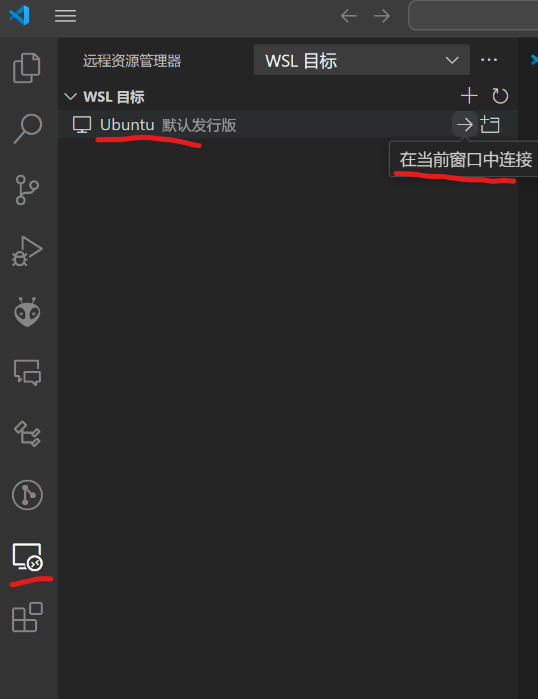


如果是第一次连接需要稍等一会自动下载安装一些服务包,并且启动完毕后还需要打开拓展页面继续安装python和jupyter插件,建议同时在本机和wsl中安装.

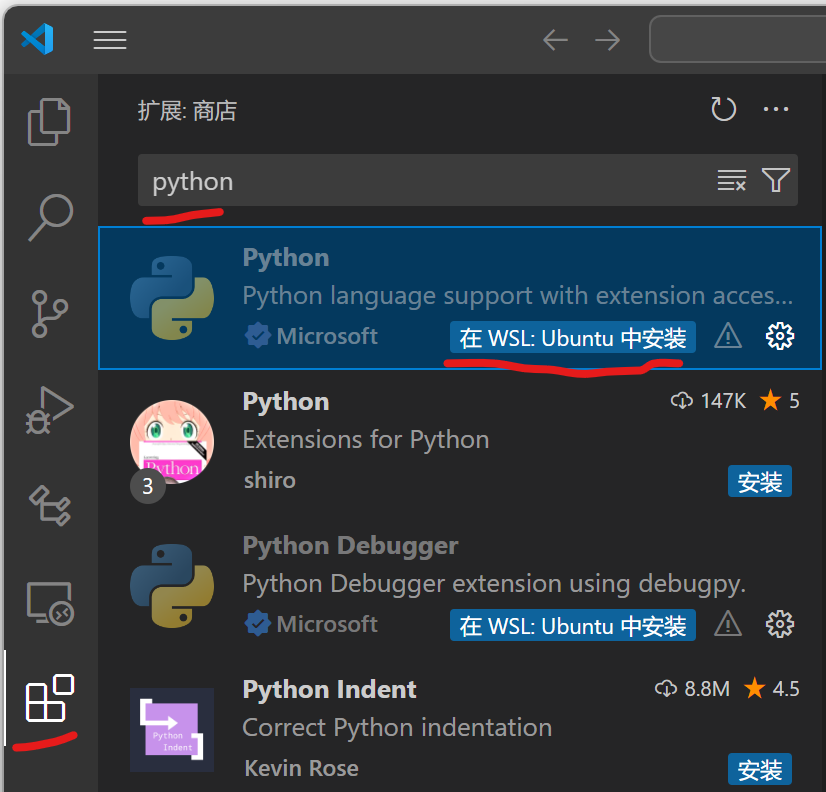

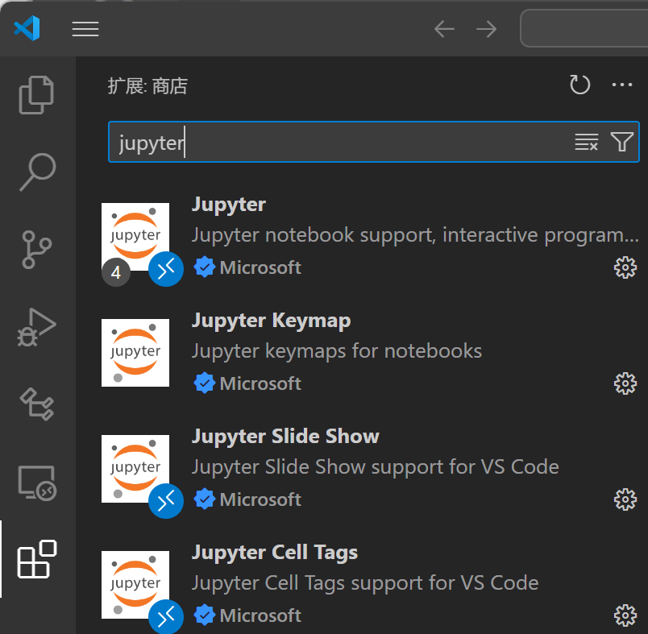

然后打开目录

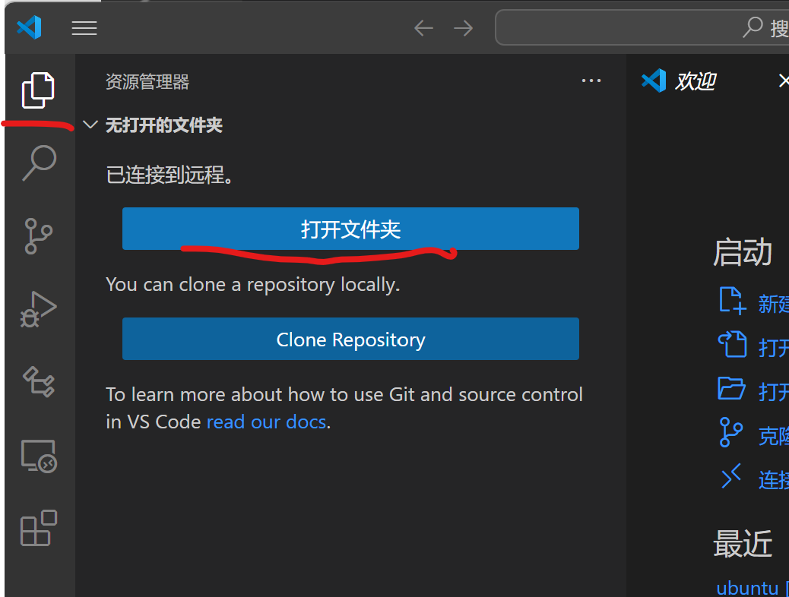

目录可能不一样 不用改 保持默认.点确定

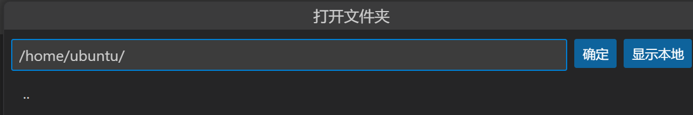

## 打开实验lab文件

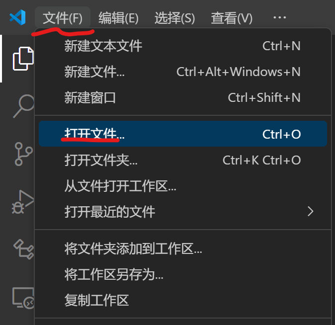

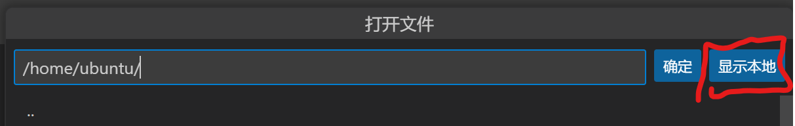

选择你下载的实验lab文件,然后选择使用的Python环境

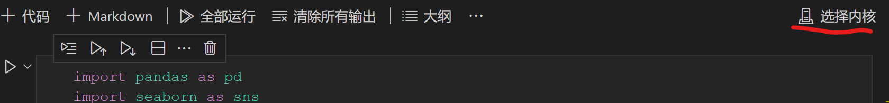

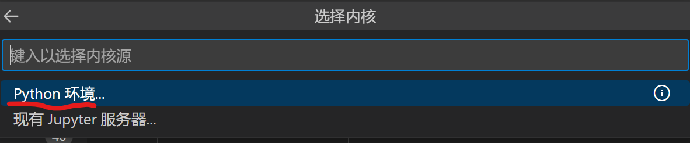

如果顺利的话这里会自动检测到名为venv的Python环境

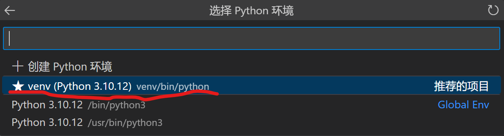

单元格左边和上面的小三角图标很实用 左边是执行单元格,上面小栏里第一个是按行执行,第二个是执行从第一个单元格执行到此单元格,第三个是执行此单元格和下面所以单元格.

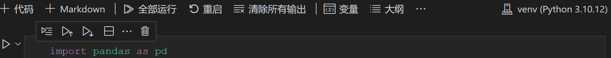

enjoy 享受快速训练吧(前提是你电脑上有一个独立显卡)

## 附 可能用到的工具

[ONNX_script](https://3939831.xyz/mypage/ONNX_script/index.html)

## 为什么不直接在windows上安装

虽然windows直接支持python和torch 但是执行某些代码会出现bug 建议直接使用linux环境 提前解决所有可能的bug
