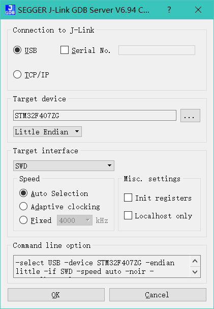
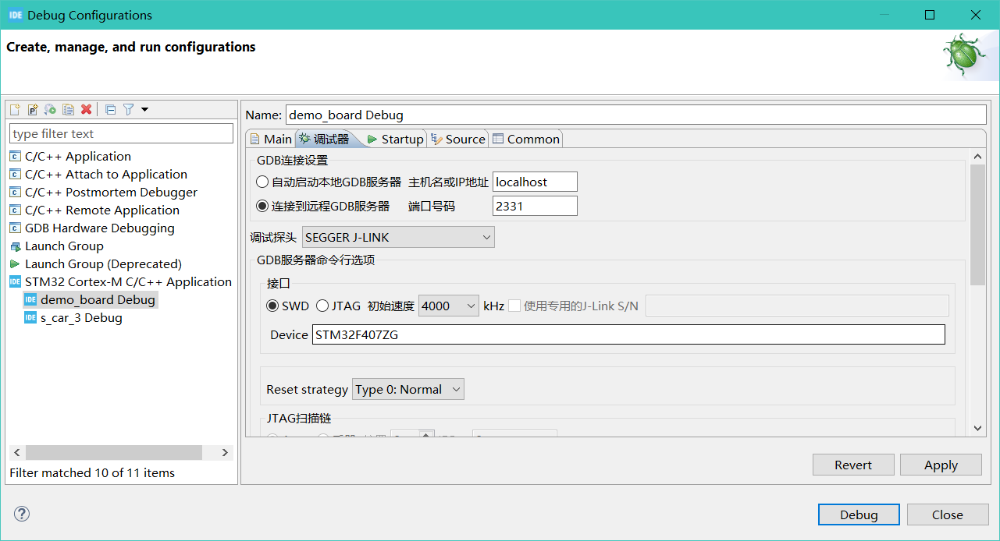
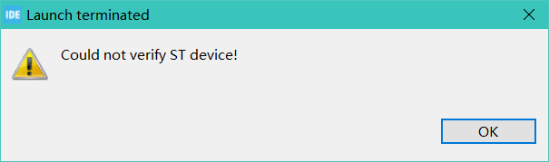
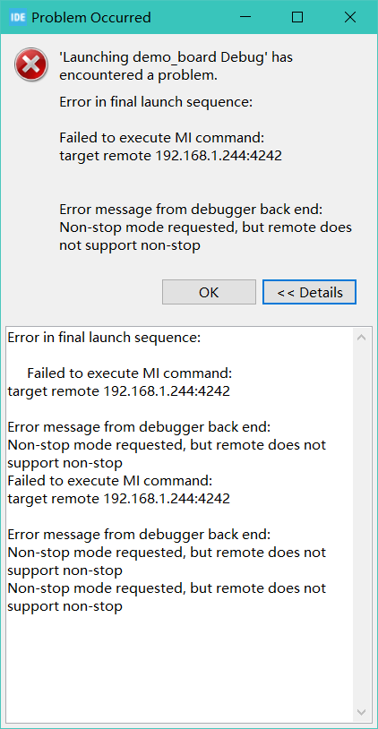
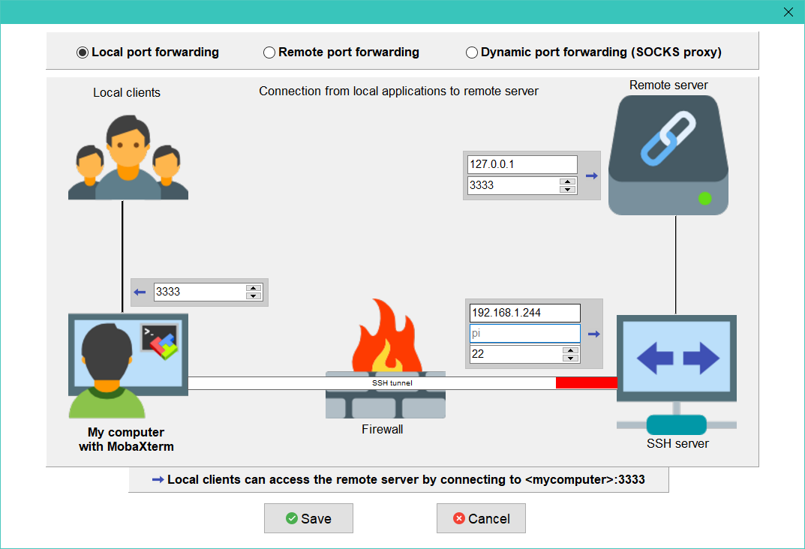

# 无线网远程调试

有时候我们不能直接接触到硬件 但是需要进行在线调试(比如 运行的小车 密封的舱体等)

本文旨在给出一种远程硬件的调试方式以及遇到的坑

~~MDK不支持此方案的远程调试~~

在MDK常用的调试器中 只有jlink有interface的配置栏 可以使用下面的第一种方法

我选用的是CubeIDE 其内置的调试方案是arm-none-eabi-gdb 可以连接到远程gdb服务器 其他同类方案均可参考

<!-- more -->

## 需要准备

1. CubeIDE
2. 树莓派（任意）
3. jlink windows套件
   [https://www.segger.com/downloads/jlink/JLink_Windows.exe](https://www.segger.com/downloads/jlink/JLink_Windows.exe)
4. jlink linux on ARM套件 给树莓派装的 [https://www.segger.com/downloads/jlink/JLink_Linux_arm.deb]([SEGGER - The Embedded Experts - Downloads](https://www.segger.com/downloads/jlink/JLink_Linux_arm.deb))
5. stlink ob v2.1 一块(推荐使用 可以刷来刷去)(必须是此版本 2.0版本的刷不了jlink ob)(也可直接使用jlink成品)

以上套件寻找的位置[https://www.segger.com/downloads/jlink](https://www.segger.com/downloads/jlink)

## 大致流程

需要提前将st-link ob刷成j-link ob

工具[https://www.segger.com/products/debug-probes/j-link/models/other-j-links/st-link-on-board/]([ST-LINK On-Board](https://www.segger.com/products/debug-probes/j-link/models/other-j-links/st-link-on-board/))

1. 电脑安装jlink windows
2. 连接至树莓派 安装jlink linux arm
3. 将jlink连接至树莓派上
4. 在电脑上启动J-Link GDB Server
5. 电脑选择配置参数 并复制最下面方块里的命令行
   
6. 树莓派命令行执行JLinkGDBServer + 你刚才复制的参数
   
7. 调试探头选jlink
   选中连接到远程GDB服务器
   主机名或IP地址填上树莓派的IP地址 端口不用变
8. ~~目前还有点小问题 不知道是什么引发的~~
   如果你出现了这样的弹窗 可见下面解决方案



原因是可能是通讯速率过高 第五步选择命令行参数是设置到1MHz以下 远程调试一切正常(、大概原因是板子信号线布置的有干扰或者芯片是仿制品)

注：有时候调试器直接连到电脑上调试也发生该错误

具体报错(MDK5 CubeIDE报错与上文相同)

```
* JLink Info: T-bit of XPSR is 0 but should be 1. Changed to 1.
```

所以有类似的错误均可怀疑频率是否过高

另外 更新下面遇到的坑的详细报错

## 坑一

### stlink gdb server模式

树莓派使用工具stlink-tools

```
sudo apt-get install stlink-tools
```

开启gdbserver

```
st-util
```

会提示端口号 但是CubeIDE连上后会出错断开

注：st-util是stlink驱动软件的开源版本 其官方对应工具在官网上只提供了x86(windows和linux)版 没有提供arm版 因此无法在树莓派上运行

#### 具体报错



```
Error in final launch sequence:

Failed to execute MI command:
target remote 192.168.1.244:4242

Error message from debugger back end:
Non-stop mode requested, but remote does not support non-stop
Failed to execute MI command:
target remote 192.168.1.244:4242

Error message from debugger back end:
Non-stop mode requested, but remote does not support non-stop
Non-stop mode requested, but remote does not support non-stop
```

###### 让openAI帮了帮我 还没试 先贴在这里

这个错误信息是与GNU Debugger (GDB)的**非停止模式**有关。非停止模式是GDB的一项功能，允许您同时调试多个线程或进程，而不会停止其他线程或进程的执行。但是，此功能需要调试器和目标系统的支持。在您的情况下，似乎您正在尝试调试的远程系统不支持非停止模式，这就是为什么您会看到此错误消息的原因。

要解决此问题，您可以尝试在GDB中禁用非停止模式，方法是在GDB控制台中运行以下命令：

```
(gdb) set non-stop off
```

这应该会禁用非停止模式，并允许您在不遇到此错误消息的情况下调试程序。

希望这可以帮助！如果您有任何其他问题，请告诉我。 😊

###### 树莓派端报错

```sh
pi@raspberrypi:/ $ st-util 
st-util 1.5.1

2021-01-15T08:07:36 INFO common.c: Loading device parameters....
2021-01-15T08:07:36 INFO common.c: Device connected is: F4 device, id 0x10076413
2021-01-15T08:07:36 INFO common.c: SRAM size: 0x30000 bytes (192 KiB), Flash: 0x100000 bytes (1024 KiB) in pages of 16384 bytes
2021-01-15T08:07:36 INFO gdb-server.c: Chip ID is 00000413, Core ID is  2ba01477.
2021-01-15T08:07:36 INFO gdb-server.c: Listening at *:4242...
2021-01-15T08:08:05 INFO gdb-server.c: Found 6 hw breakpoint registers #此行开始
2021-01-15T08:08:05 INFO gdb-server.c: GDB connected.
2021-01-15T08:08:06 ERROR gdb-server.c: cannot recv: -2
```

但是直接用arm-none-eabi-gdb裸连可以

## 坑二

### OpenOcd模式(jlink模式)

树莓派使用工具OpenOcd

```
sudo apt-get install openocd
```

开启

```
openocd -f /usr/share/openocd/scripts/interface/jlink.cfg -f /usr/share/openocd/scripts/target/stm32f4x.cfg
```

失败(直接报错)

```
Open On-Chip Debugger 0.10.0
Licensed under GNU GPL v2
For bug reports, read
        http://openocd.org/doc/doxygen/bugs.html
Info : auto-selecting first available session transport "jtag". To override use 'transport select <transport>'.
adapter speed: 2000 kHz
adapter_nsrst_delay: 100
jtag_ntrst_delay: 100
none separate
cortex_m reset_config sysresetreq
Info : No device selected, using first device.
Warn : Starting write / read operation (length = 1 / 2 bytes).
Warn : Sent 1 bytes to device.
Warn : Received 2 bytes from device.
Warn : Read 2 bytes from buffer.
Warn : Starting read operation (length = 112 bytes).
Warn : Received 112 bytes from device.
Warn : Read 112 bytes from buffer.
Info : J-Link STLink V21 compiled Aug 12 2019 10:29:20
Warn : Starting write / read operation (length = 1 / 4 bytes).
Warn : Sent 1 bytes to device.
Warn : Received 4 bytes from device.
Warn : Read 4 bytes from buffer.
Warn : Starting write / read operation (length = 1 / 32 bytes).
Warn : Sent 1 bytes to device.
Warn : Received 32 bytes from device.
Warn : Read 32 bytes from buffer.
Warn : Starting write / read operation (length = 1 / 4 bytes).
Warn : Sent 1 bytes to device.
Warn : Received 4 bytes from device.
Warn : Read 4 bytes from buffer.
Info : Hardware version: 1.00
Warn : Starting write / read operation (length = 1 / 256 bytes).
Warn : Sent 1 bytes to device.
Warn : Received 256 bytes from device.
Warn : Read 256 bytes from buffer.
Warn : Starting write / read operation (length = 1 / 8 bytes).
Warn : Sent 1 bytes to device.
Warn : Received 8 bytes from device.
Warn : Read 8 bytes from buffer.
Info : VTarget = 3.300 V
Warn : Starting write / read operation (length = 14 / 76 bytes).
Warn : Sent 14 bytes to device.
Warn : Received 76 bytes from device.
Warn : Read 76 bytes from buffer.
Warn : Starting write / read operation (length = 2 / 4 bytes).
Warn : Sent 2 bytes to device.
Warn : Received 4 bytes from device.
Warn : Read 4 bytes from buffer.
Error: Selected transport is not supported by the device.
```

#### 让openAI帮了帮我

您好！您提供的日志显示，您正在使用 Open On-Chip Debugger 0.10.0[1](https://stackoverflow.com/questions/14194813/calling-a-webservice-by-php-error-no-transport-found-or-selected-transport)。根据日志，您的设备自动选择了第一个可用的会话传输 “jtag”。但是，最后出现了错误提示：“Selected transport is not supported by the device”。

这个错误提示意味着您选择的传输方式不受设备支持。您可以尝试使用 ‘transport select <transport>’ 命令来覆盖自动选择的传输方式[2](https://openocd.org/doc/html/Debug-Adapter-Configuration.html)。希望这些信息能够帮助您解决问题。如果您有其他问题，请随时告诉我。😊

可能是当时用的是swd 没连上jtag的线 回头再试试 可行性很高

### 换用stlink

```
openocd -f /usr/share/openocd/scripts/interface/stlink-v2-1.cfg -f /usr/share/openocd/scripts/target/stm32f4x.cfg
```

需要进行代理



IDE连接本地3333端口

失败

IDE无报错 直接断开

树莓派报错

```
pi@raspberrypi:/ $ openocd -f /usr/share/openocd/scripts/interface/stlink-v2-1.cfg -f /usr/share/openocd/scripts/target/stm32f4x.cfg
Open On-Chip Debugger 0.10.0
Licensed under GNU GPL v2
For bug reports, read
        http://openocd.org/doc/doxygen/bugs.html
Info : auto-selecting first available session transport "hla_swd". To override use 'transport select <transport>'.
Info : The selected transport took over low-level target control. The results might differ compared to plain JTAG/SWD
adapter speed: 2000 kHz
adapter_nsrst_delay: 100
none separate
Info : Unable to match requested speed 2000 kHz, using 1800 kHz
Info : Unable to match requested speed 2000 kHz, using 1800 kHz
Info : clock speed 1800 kHz
Info : STLINK v2 JTAG v37 API v2 SWIM v26 VID 0x0483 PID 0x374B
Info : using stlink api v2
Info : Target voltage: 3.234714
Info : stm32f4x.cpu: hardware has 6 breakpoints, 4 watchpoints
Info : accepting 'gdb' connection on tcp/3333
Info : device id = 0x10076413
Info : flash size = 1024kbytes
undefined debug reason 7 - target needs reset
Info : rejected 'gdb' connection, no more connections allowed
Info : dropped 'gdb' connection
```

但是直接用arm-none-eabi-gdb裸连也可以

##### 分析日志

您好！您提供的日志显示，您正在使用 Open On-Chip Debugger 0.10.0。根据日志，您的设备自动选择了第一个可用的会话传输 “hla_swd”。但是，系统无法匹配请求的速度 2000 kHz，因此使用了 1800 kHz。

日志中还显示，您的设备使用了 STLINK v2 JTAG v37 API v2 SWIM v26，目标电压为 3.234714 V。stm32f4x.cpu 硬件具有 6 个断点和 4 个监视点。

此外，日志中还显示了一些警告和错误信息。例如，“undefined debug reason 7 - target needs reset” 表示目标需要重置。“rejected ‘gdb’ connection, no more connections allowed” 和 “dropped ‘gdb’ connection” 表示 gdb 连接被拒绝和丢弃 。

希望这些信息能够帮助您解决问题。如果您有其他问题，请随时告诉我。😊

## 集成硬件设想

树莓派zero w + 底板(jlink ob或stlink ob刷jlink ob) 连接到目标板上

成本大概在一百二三十~~(可能还要低一些)~~中间有一段时间又贵了。

连七八糟的其他派应该也可以用 还更便宜

## 其他方案

另外还有两种方案稍微提一下

### jlink自带无线调试

jlink官网上有介绍无线调试的功能 ~~不过原理差不多 就是GDBserver和usb透传(ipusb)~~（我没用过 不了解）

不过价格很贵 盗版普通版的没有这种功能

### 自己搓

可以试试使用GDBserver或者usb透传(ipusb)

使用usb透传在本地虚拟出一个usb设备

CUBEIDE只支持jlink和stlink 并不支持cmsis-dap

### 第三方cmsis-dap

如正点原子 配有发送和接收端 无线使用esp8266连接 不开源

### 开源无线esp8266

https://github.com/thevoidnn/esp8266-wifi-cmsis-dap

### 开源black magic for esp8266

https://github.com/walmis/blackmagic-espidf

# 