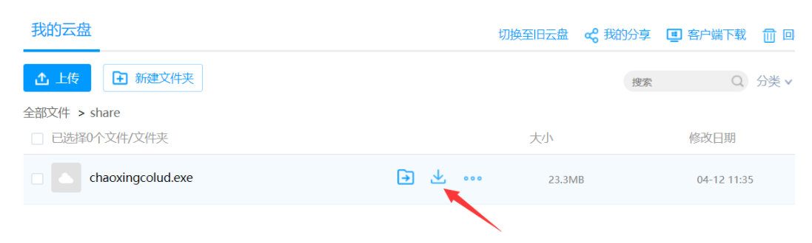

开源图床工具 超星云盘图床工具 配合typora使用
超星云盘直连分享技巧

方法有风险 请不要在使用了
仅作为学习使用

<!-- more -->
# 开源图床工具 超星云盘图床工具 配合typora使用

1. 下载[此工具](http://d0.ananas.chaoxing.com/download/2906b5aacdac0d6055d9745aae999c17?fn=chaoxingcolud) 并[在此](https://passport2.chaoxing.com/register3?refer=http%3A%2F%2Fpan-yz.chaoxing.com%2F)注册超星账号

2. 放到任意目录下(此处以D:\GreenSoftware\pyfigerbed为例)

3. 打开typora->文件->偏好设置

4. 图像->上传服务->Custom Command

5. 自定义命令栏->输入工具所在的位置

6. 点"验证图片上传选项" 弹出登录窗口 

7. 大功告成 你可以用一个markdown文件测试

   图片全部挂了 已经清除掉所有挂了的图片

[开源地址](https://github.com/czstara12/chaoxingpantool)

## 注意

超星云盘开有防盗链机制 导致放上去的图片链接网页中会加载不出来

可以按照以下反防盗链方法

https://www.playpi.org/2019042701.html

## 反防盗链

> 清除 Referer 参数
>
> ## 尝试清除来源引用
>
> 在静态网页的 **头部** 代码中【即 head 标记】添加如下配置项：
>
> ```
> <meta name="referrer" content="no-referrer" />
> ```
>
> 它的作用就是阻止浏览器发送 **Referer** 信息，对整个页面的所有链接生效【当然也有针对单个链接设置的方法：<a rel="noreferrer" href="your-website-url" />，这里不采用】，这样一来微博图床就不知道请求的引用来源了，可以达到和直接在浏览器中访问一样的效果。 **但是要注意，不是每种浏览器都支持这种语法的，此设置对有的浏览器来说无效。**
>
> 那么在 Hexo 框架中怎么增加呢，显然不会有相关配置项，只能更改源代码，而且使用了 Next 主题，应该要更改主题的源代码，以保证 Hexo 在渲染静态页面为每个页面都增加这个配置。查阅文档，了解了渲染模板所在位置，打开 **themes/next/layout/_partials/head.swig** 文件，在里面添加 meta 标记就行。
>
>
> 
>
> 修改 head.swig 文件

## 超星云盘直连分享技巧

此技巧多半也无效了 短时间可能有效 时间稍长可能随着链接更新而失效

1. 登录[此网页](http://pan-yz.chaoxing.com/)


2. 找到要分享的文件 点下载



3. 在下载记录或下载窗口里复制对应的下载链接


4. 此链接可以直接分享 下载方不需登录超星账号